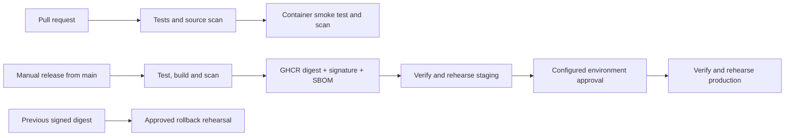

# CI/CD Pipeline: Verified Container Delivery

[](https://github.com/joshr988/CI-CD-Pipeline/actions/workflows/ci.yml)

A portfolio project demonstrating container delivery controls with GitHub Actions:
tested builds, security gates, signed artifacts, approval gates, and rollback rehearsals.

Staging and production are **temporary container rehearsals on GitHub runners**.
They do not host a persistent application. This demonstrates production practices;
it is not a claim of operating an enterprise production service.



## Engineering decisions

| Control | Implementation | Why it matters |
| --- | --- | --- |
| Build once | Release builds one image; jobs consume its SHA-256 digest | Staging and production exercise identical bytes |
| Supply chain | Cosign keyless signing and signed SPDX SBOM | Verification checks the issuing workflow and branch |
| Identity | GitHub OIDC for signing; scoped GitHub token for GHCR | No stored signing key or registry password |
| Isolation | Non-root container, read-only filesystem, dropped capabilities | Limits runtime privileges |
| Security gates | Trivy source secrets and HIGH/CRITICAL vulnerabilities | Findings block delivery; no blanket ignore list |
| Workflow integrity | Actions pinned to commits; Dependabot updates | Third-party action updates are reviewed |
| Release controls | Manual main-branch release, environment gates, serialized delivery | Makes promotion explicit and traceable |
| Recovery | Re-verify and exercise a previous digest without rebuilding | Demonstrates artifact-based recovery |

## Run locally

Requires Python 3.12+ and Docker. The API uses the Python standard library with no
third-party runtime dependencies. Its HTTP server is deliberately a demo server.

```sh
python3 -m unittest discover -s tests -v
docker build --build-arg REVISION=local -t cicd-demo:local .
bash scripts/smoke.sh cicd-demo:local
```

The smoke test starts a restricted container, checks `/health` and `/version`,
then removes that container even if a check fails. To explore it manually:

```sh
docker run --rm -p 127.0.0.1:8080:8080 cicd-demo:local
```

## Configure GitHub before releasing

1. Push these files and let **CI / quality** pass on `main`.
2. In Settings > Environments, create `staging` and `production`.
3. Restrict both environments to `main`. Configure a required reviewer for
   `production`; naming an environment in YAML does not create an approval rule.
   For a solo demonstration, self-approval must remain allowed. A team should
   prevent self-review and select an independent reviewer.
4. Protect `main` with a ruleset requiring pull requests and the `quality` status
   check. Require independent review when another collaborator is available.
5. Ensure repository policy permits Actions to publish GitHub Packages. No custom
   secrets are required. Existing GHCR packages may need this repository granted
   Actions access. Images may initially be private; make the package public if
   you want visitors to pull it.
6. In Actions, run **Release** on `main`. Inspect the staging result, approve the
   production environment, then capture the final summary containing the digest.

Environment approvals must be configured in repository settings. See the
[GitHub environment documentation](https://docs.github.com/en/actions/how-tos/deploy/configure-and-manage-deployments/managing-environments-for-deployment).

## Demonstrate a blocked change

Create a pull request that temporarily changes `/health` to return a different
status body. The HTTP test must fail, and the required check should block merge.
Revert that deliberate change on the pull request and show the check recovering.
Do not use real credentials to demonstrate secret scanning.

## Rollback rehearsal

Copy the full `ghcr.io/joshr988/ci-cd-pipeline@sha256:...` reference from a previous
successful release summary. Run **Rollback rehearsal** from `main` with that
reference, and approve the production environment. The workflow rejects other
repositories and malformed digests, verifies the release signature and SBOM,
then starts and checks the old image. No application is persistently switched:
this is a recovery rehearsal, not a live traffic rollback.

## Portfolio evidence

After running this in GitHub, add screenshots of a passing CI run, a blocked
pull request, the production approval screen, and a completed release showing
the same digest in both environments. Link those actual runs in your LinkedIn
post. Explain one tradeoff and one failure you diagnosed in your own words.

## Scope and next steps

This starter has HTTP tests and syntax checks, not a full lint or coverage gate.
The container uses Python on Alpine to reduce unnecessary OS packages. The
initial Debian-based build was blocked by 44 HIGH findings; the scan threshold
remains unchanged. Trivy checks OS packages as well as source secrets. Scanner feeds
can introduce new failures: update affected dependencies rather than disable the
gate. The Python base tag receives updates and is not digest-pinned, so rebuilding
an old commit can change the base; promotion still uses an immutable image digest.

Real production would additionally need persistent infrastructure, a production
application server, infrastructure-as-code, runtime secrets, monitoring, service
objectives, and a tested traffic-switching rollback. OIDC here authenticates
signing; there is no cloud deployment identity. GitHub-hosted execution and
signature verification must be validated by actual workflow runs before claiming
them as demonstrated evidence.
